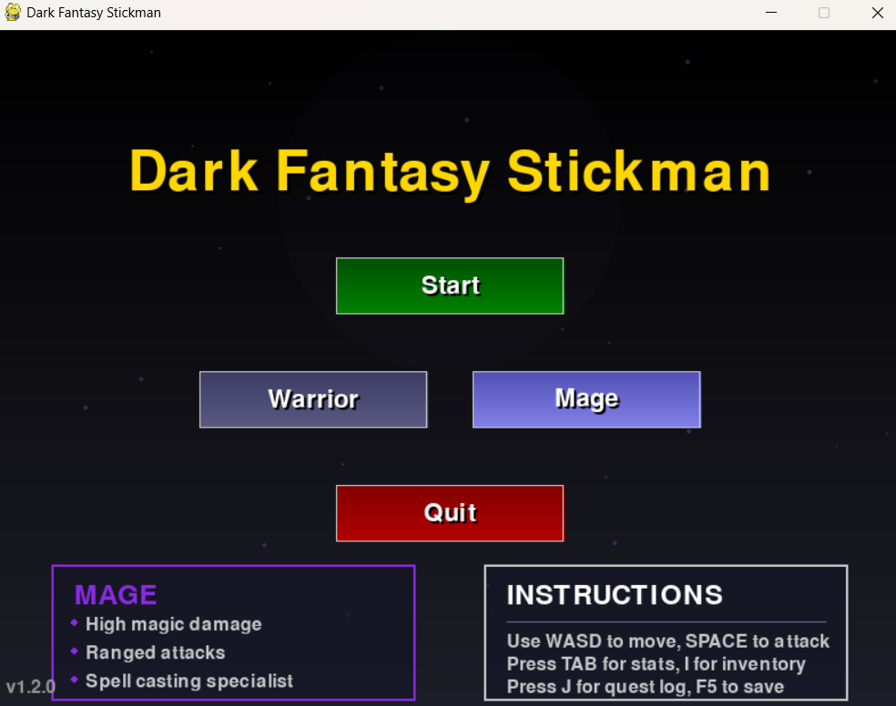
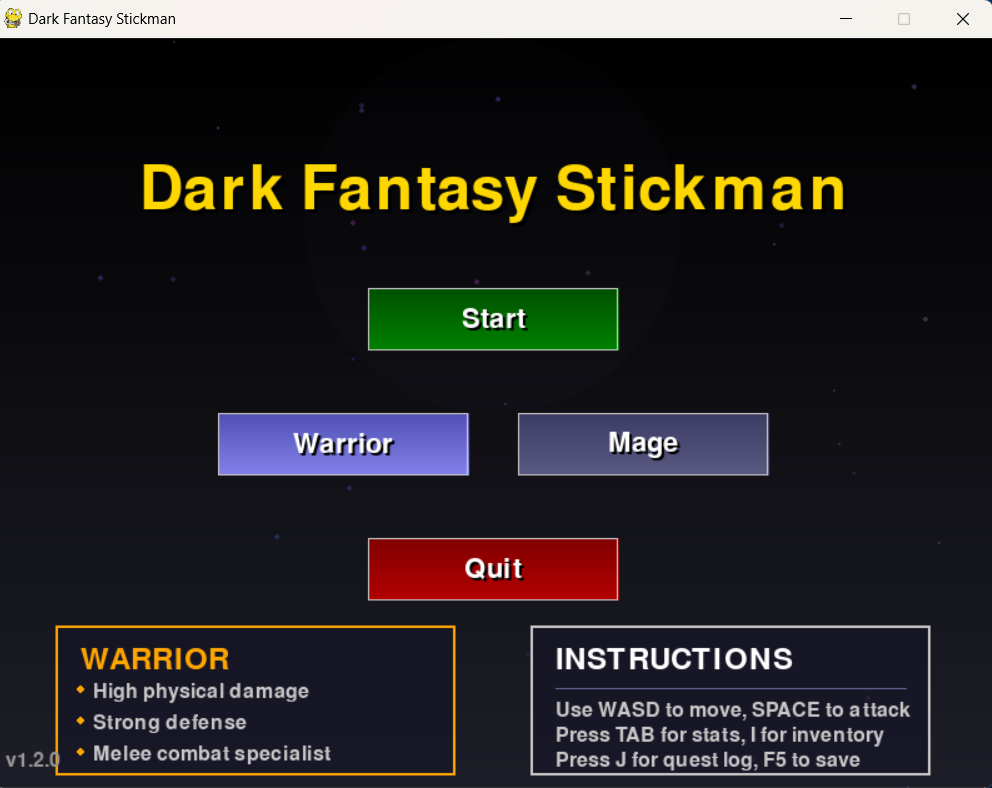
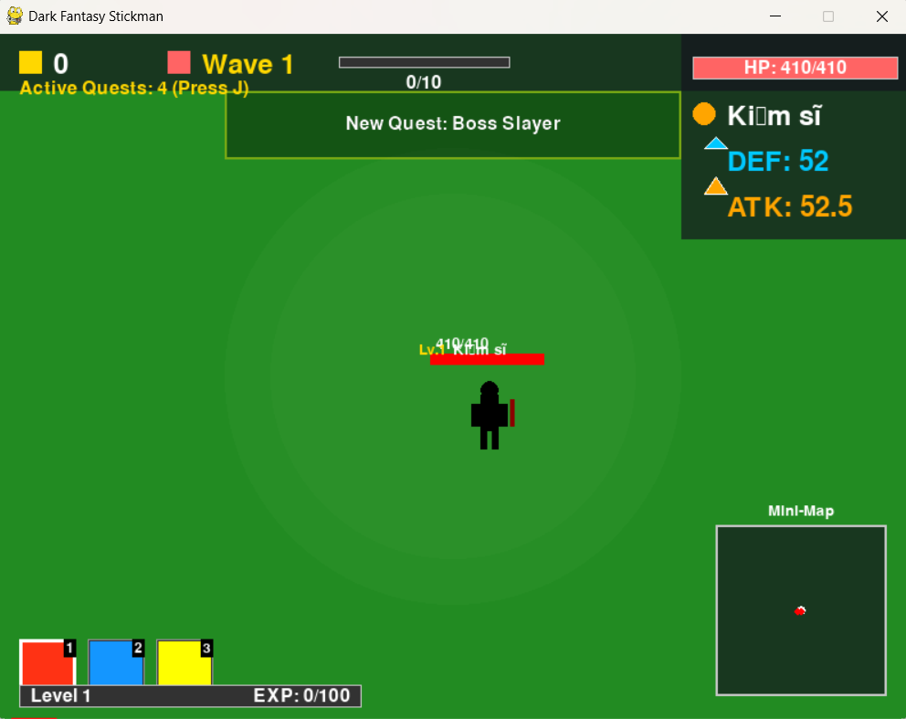
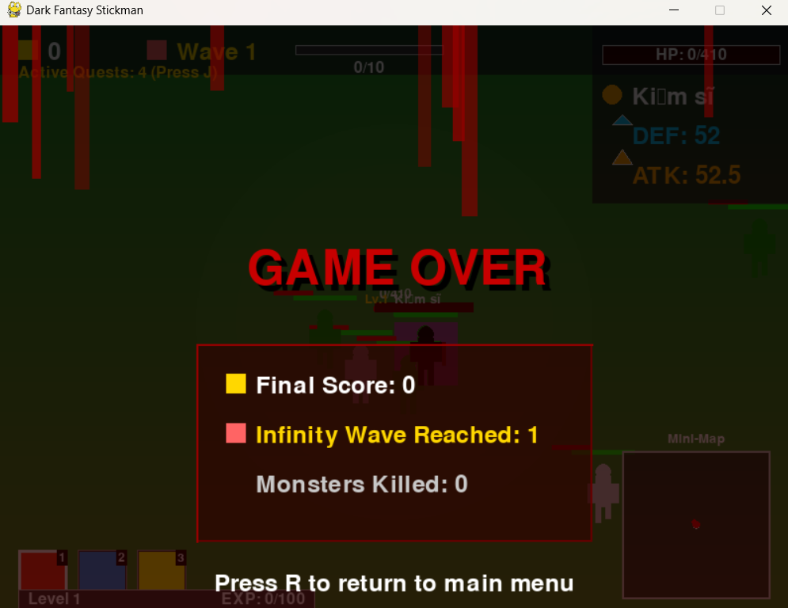

# Dark Fantasy Game

Dark Fantasy Game is a simple game written in Python, using sprite animations to represent characters and combat actions in a fantasy world.

## 🧙 Characters

- Goblin  
- Mage  
- Skeleton  
- Warrior  

Each character has its own set of sprites for actions such as: idle, attack, walk, hurt, and death.

## 🎮 Gameplay

The player controls a main character to fight against monsters in a fantasy environment. The game may include features such as:

- Move the character using keyboard keys (arrow keys or WASD).
- Attack, dodge, or use special abilities.
- Health and damage system between characters.
- Defeat enemies to earn higher scores or complete levels.

## 📁 Project Structure
```
game/
├── dark_fantasy_game.py
├── dark_fantasy_game_enhanced.py
├── game_stats.py
├── dark_fantasy_game/
│   ├── __init__.py
│   ├── assets/
│   │   └── sprites/
│   │       ├── goblin_*.png
│   │       ├── mage_*.png
│   │       ├── skeleton_*.png
│   │       └── warrior_*.png
│   └── src/
│       ├── abilities.py
│       └── animation.py
```

## 🚀 How to Run

1. Make sure **Python 3.x** is installed.
2. Install required libraries (if any):
   ```bash
   pip install -r requirements.txt
   ```
3. Run the game:
   ```bash
   python game/dark_fantasy_game.py
   ```

## 📦 System Requirements

- Python 3.7+
- Libraries: pygame

## 📸 Screenshots





## 👨‍💻 Author

- Tran Quoc Huy
- GitHub: [https://github.com/TrQuHuy](https://github.com/TrQuHuy)

## 📄 License

This project is licensed under the MIT License. See [LICENSE](./LICENSE) for more details.
